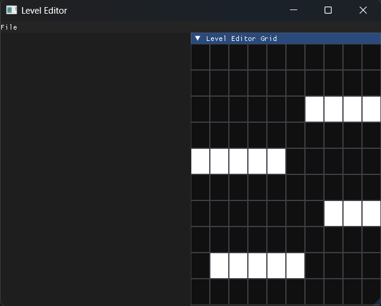

# Game Level Editor

A standalone 2D level editor built in C++ using SDL3 and Dear ImGui.  
This tool enables the creation, editing, validation, and JSON export of tile-based game levels.

This project is designed for portfolio demonstration purposes and showcases software architecture, UI tooling, and data-driven design.

---

## Overview

Game Level Editor is a custom-built tool for designing 2D tile-based game levels through a graphical interface.

It demonstrates:

- C++ application architecture
- Immediate-mode GUI integration (Dear ImGui)
- Structured serialization with JSON
- Modular system design
- Editor tooling workflows

The project is currently a work in progress.

---

## Features

### Grid-Based Editing

- Configurable 2D grid
- Mouse-based tile placement
- Real-time visual updates

### Entity Management (in future updates)

- Placement and removal of gameplay entities
- Separation between static tiles and dynamic entities
- Basic per-entity configuration

### Serialization

- Export levels to structured JSON files
- Import existing levels for modification
- Human-readable, engine-agnostic format

### Validation

- Structural validation before export
- Detection of invalid or incomplete configurations

### User Interface

- Built with Dear ImGui
- Modular editor panels
- Immediate feedback interaction model

---

## Screenshots



---

## Architecture

The project follows a modular architecture separating concerns between data management, UI, and serialization.

### Core Systems

- **Grid System**  
  Manages tile storage, coordinates, and placement logic.

- **Entity System**  
  Handles dynamic objects independently from tile data.

- **Serialization Layer**  
  Converts in-memory level representation to and from JSON.

- **UI Layer**  
  Built with ImGui. Responsible for tools, panels, and editor interaction.

### Design Principles

- Clear separation between data and presentation
- JSON-driven level definition
- Extensible entity structure
- Maintainable modular layout

---

## Project Structure

.
├───exports/            \
├───imgui/              \
├───include/            \
├───json/               \
├───nativefiledialog/   \
├───screenshots/        \
├───SDL3-3.2.28/        \
├───src/                \
├───CMakeLists.txt      \
└───README.md           \

---

## JSON Level Format

Levels are exported to the `exports/` directory in JSON format.

Example:

```json
{
    "Tile types": {
        "default": {
            "name": "default"
        },
        "test": {
            "name": "test"
        }
    },
    "level": {
        "entities": [
            {
                "id": "enemy_1",
                "params": {},
                "type": "enemy",
                "x": 1,
                "y": 1
            }
        ],
        "grid": {
            "height": 2,
            "tiles": [
                [
                    "test",
                    "default"
                ],
                [
                    "default",
                    "test"
                ]
            ],
            "width": 2
        },
        "version": 1
    }
}
```

## Build Instructions

The project uses CMake. To build:

```sh
mkdir build
cd build
cmake ..
make
```

Executable "level_editor" in build directory
